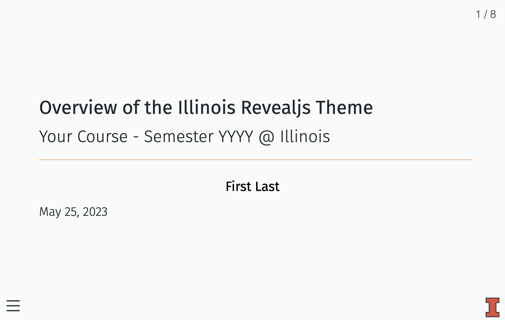

# Quarto-illinois Extension For Quarto

A [quarto extension](https://quarto.org/docs/extensions/) featuring an [Illinois-inspired theme](https://marketing.illinois.edu/visual-identity/color) for the [reveal.js format](https://quarto.org/docs/presentations/revealjs/).

## Installing

You can obtain a copy of the extension by using: 

```bash
quarto use template coatless/quarto-illinois
```

This will install the extension and create an example qmd file that 
you can use as a starting place for your presentation slides.

## Using

Once the extension is installed, you can use the extension by setting the `format` inside of the document header to `illinois-revealjs`.

```markdown
---
title: A title
subtitle: A subtitle
format:
  illinois-revealjs: default
author:
  - name: Your Name
    orcid: 0000-0000-0000-0000
    email: alias@email.com
    affiliations: Your Institution
date: last-modified
---
```

If you wanted to use other [reveal.js features in quarto](https://quarto.org/docs/presentations/revealjs/), add the options under the `illinois-revealjs` format. For example, we can use the [`chalkboard`](https://quarto.org/docs/presentations/revealjs/presenting.html#chalkboard) feature by setting: 

```yaml
format:
  illinois-revealjs: 
    chalkboard: true
```

## Example

See the included [template.qmd](template.qmd) file for an example of the slide deck:



## Developer Notes

We created the quarto extension for the revealjs format by using: 

```sh
quarto create extension format:revealjs
```

From there, we incorporated a modified version of the [Beamer Metropolis](https://github.com/matze/mtheme) that was ported into a [Quarto theme](https://codeberg.org/pat-s/quarto-metropolis) by [Patrick Schratz](https://pat-s.me/) ([Post](https://pat-s.me/quarto-metropolis-theme/)). 


## Acknowledgements

This theme is built ontop of the design and implementation work of [Matthias Vogelgesang](https://bloerg.net/) ([Beamer Metropolis](https://github.com/matze/mtheme)) and [Patrick Schratz](https://pat-s.me/) ([Quarto Metropolis theme](https://codeberg.org/pat-s/quarto-metropolis)).

We also appreciate for [Shafayet Khan Shafee](https://github.com/shafayetShafee) for making available an alternative port known as [`metropolis-revealjs`](https://github.com/shafayetShafee/metropolis) based on the gist containing [`metropolis.css`](https://gist.github.com/vhodges/e37893eecde3f3333150) by [Vince Hodges](https://github.com/vhodges).

Additionally, we relied upon the following documentation:

- [Quarto Documentation: Custom Formats](https://quarto.org/docs/extensions/formats.html)
- [Quarto Revealjs Clean Theme](https://github.com/grantmcdermott/quarto-revealjs-clean) by [Grant McDermott](https://github.com/grantmcdermott)